# Guide utilisateur Pogues
Version au 15/03/2019

---

# Les grands principes de Pogues
Outil de conception de questionnaires pour la collecte pilotée par la métadonnée

- Intégré dans les systèmes d'information RMéS-Coltrane
	- Utilisant les métadonnées RMéS
	- Produisant des questionnaires Coltrane en passant par le générateur de questionnaires Eno
- Population cible : le concepteur d'enquête
- Focus : visualiser le rendu du questionnaire en un clic, des itérations rapides

---
# Pogues, l'architecture fonctionnelle

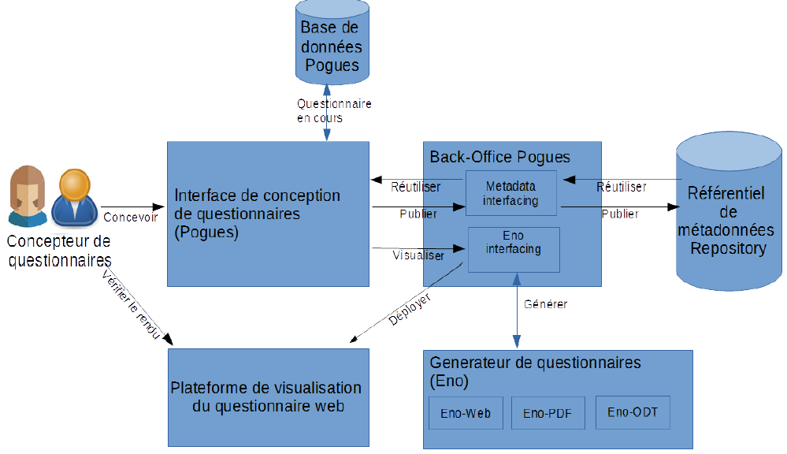

---

# Connexion à l'application 

- Dans son navigateur Internet, saisir :
http://conception-questionnaires.insee.fr

- Saisir son idep puis valider en cliquant sur "OK"

---

# Conseil pour la saisie 

Afin d'éviter d'embarquer des caractères spéciaux qui pourraient compromettre parfois le bon fonctionnement de l'application, on conseille fortement d'utiliser un intermédiaire de type Notepad++ (encodage en UTF8) voire Bloc-Notes comme intermédiaire pour les copier/coller entre votre liste de questions originelle et Pogues.

---

# Création d'un nouveau questionnaire

Cliquer sur le bouton "Nouveau questionnaire"
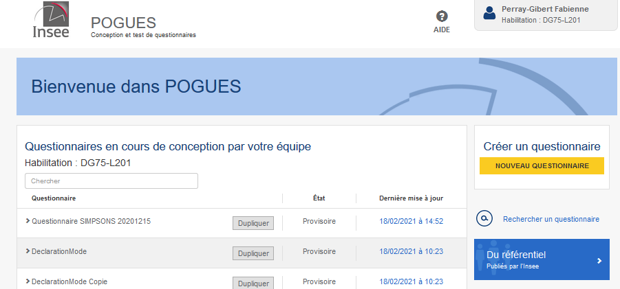

---

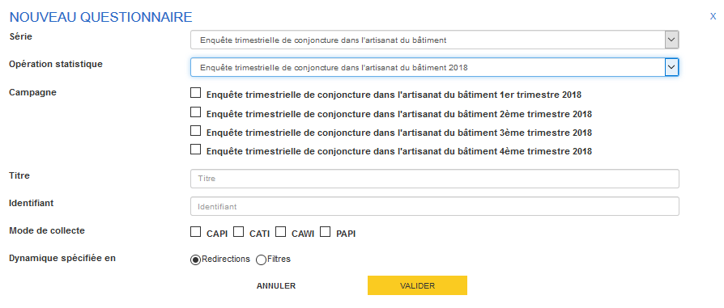

Renseigner :
- la série d'opérations statistiques concernée :
	- exemple : Enquête trimestrielle de conjoncture dans l'artisanat du bâtiment
- l'opération statistique concernée :
	- exemple : Enquête trimestrielle de conjoncture dans l'artisanat du bâtiment 2018

---

Renseigner (suite) :
- la ou les campagnes concernées :
	- exemple : 1er trimestre 2018 et 3ème trimestre 2018
- le titre du questionnaire
- l'identifiant métier du questionnaire 
	- correspond à un libellé court, par défaut l'application propose les premiers caractères du libellé long, saisir le nom du modèle de l'enquête dans Coltrane
- le mode de collecte (pas encore fonctionnel)
 	- CAPI (face à face), CATI (téléphone), CAWI (Internet), PAPI (papier) 

- Valider la saisie via le bouton "Valider".

---

# Saisie des méta-données du questionnaire

Au départ, un message d'erreur indique que le questionnaire doit comporter au moins une séquence et une question !

---

# Création d'une séquence

Une séquence est une partie ou module de questionnaire. Elle correspond à un style d'affichage "dédié" (cf. diapo exemple d'affichage) et délimite une même page web du questionnaire. Toutes les questions d'une même séquence apparaîtront sur la même page web. Si le questionnaire comportent deux séquences, il se composera de deux pages web, l'une relative à la première séquence et l'autre à la deuxième.

---

# Création d'une séquence (suite)
Cliquer sur le bouton +Séquence en bas de l'interface Pogues

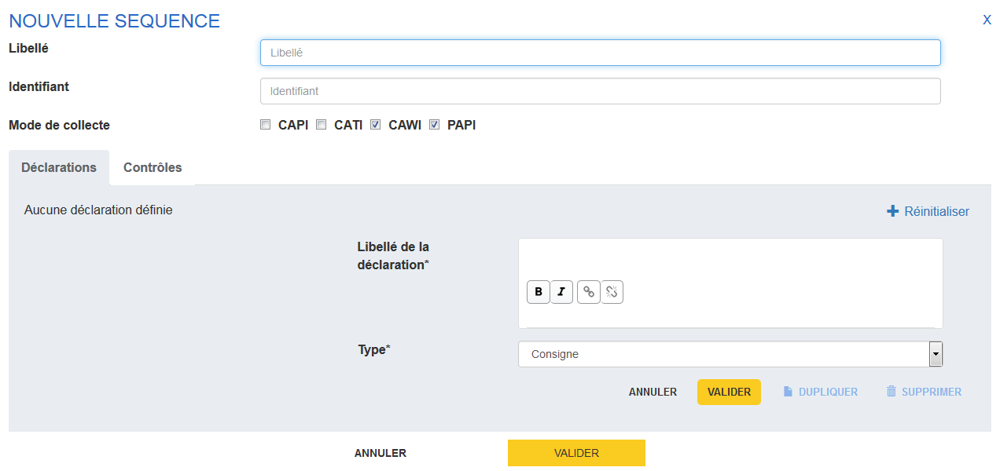

---

Renseigner :
- le libellé de la séquence 
- l'identifiant métier de la séquence :
    -	correspond à un libellé court, par défaut l'application propose les premiers caractères du libellé long
- modifier les modes de collecte si la séquence ne concerne pas tous les modes associés au questionnaire
- Si besoin, renseigner une déclaration dans l'onglet "Déclarations" dédié (cf. Création d'une déclaration)
- Si besoin, renseigner un contrôle dans l'onglet "Contrôles" dédié (cf. Création d'un contrôle)
- Valider
---

# Création d'une sous-séquence

Une sous-séquence est une partie d'une séquence, soit un sous-module du questionnaire. Un questionnaire comporte une ou plusieurs séquences, chacune d'elles peut comporter entre 0 et plusieurs sous-séquences. La sous-séquence se caractérise par un style d'affichage "dédié" (cf. diapo exemple d'affichage) mais contrairement à la séquence, elle n'a pas d'impact sur le nombre de pages web du questionnaire. Une sous-séquence correspond à une partie de page web avec un « titre » de sous-séquence, qui regroupe des questions relatives à une même thématique.

---

- Cliquer sur le bouton +Sous-Séquence en bas de l'interface Pogues

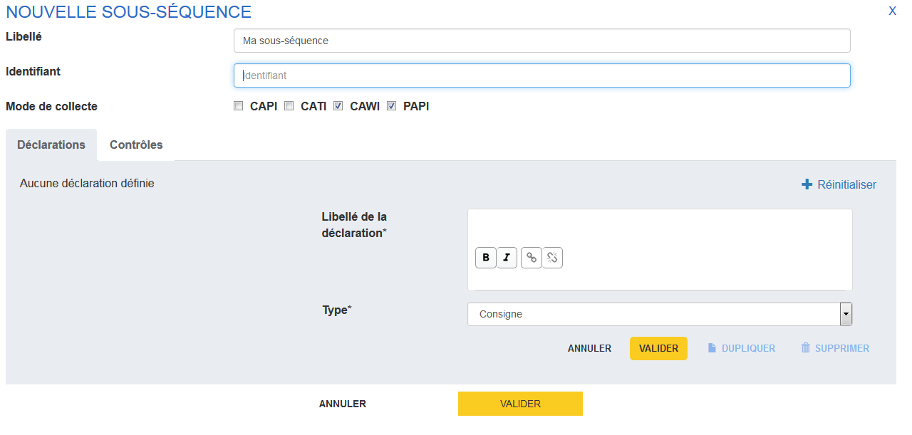

---

Renseigner :
- le libellé de la sous-séquence 
- l'identifiant métier de la sous-séquence :
    - correspond à un libellé court, par défaut l'application propose les premiers caractères du libellé long
- modifier les modes de collecte si la sous-séquence ne concerne pas tous les modes associés au questionnaire
- Si besoin, renseigner une déclaration dans l'onglet "Déclarations" dédié (cf. Création d'une déclaration)
- Si besoin, renseigner un contrôle dans l'onglet "Contrôles" dédié (cf. Création d'un contrôle)
- Valider
    
---

# Exemple d'affichage web d'une séquence, sous-séquence, question

---

# Création d'une question

Cliquer sur le bouton +Question

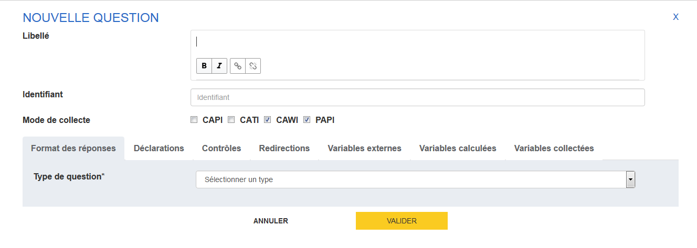

---

Renseigner
- le libellé de la question
- l'identifiant court de la question 
	- libre choix du concepteur mais dans le cas où la question correspond à une seule réponse et donc à une seule variable collectée, l'identifiant métier de la variable collectée semble la meilleure option !
- modifier les modes de collecte si la question ne concerne pas tous les modes associés au questionnaire
- le type de question
	- Réponse simple (texte, date, nombre ou booléen), Réponse à choix unique, Réponse à choix multiple (cf. batterie de questions), Tableau
		
---

# Création d'une question de type Réponse simple

Exemples :

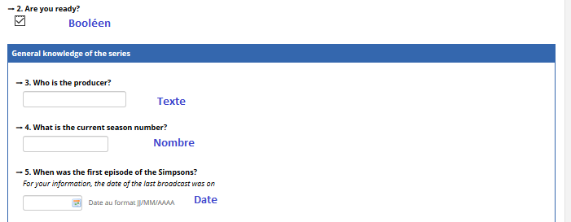

---

Si j'ai créé une question de type Réponse simple, renseigner :
- le caractère Obligatoire  de la réponse : cochable, décochable. Non fonctionnel à ce jour.
- le type de réponse :
	- Texte, Date, Nombre, Booléen
- si type de réponse=Texte, renseigner la taille maximale de la réponse en nombre de caractères, le motif (non fonctionnel pour l'instant, il permettra de spécifier des expressions régulières comme un Siret, un mèl etc.)
- si type de réponse=Date, on ne renseigne rien d'autre pour l'instant et on se retrouve avec une réponse au format JJ/MM/AAAA et une aide à la saisie de type calendrier cliquable
   
		
---

Si j'ai créé une question de type Réponse simple, renseigner (suite) :
- si type de réponse=Nombre, renseigner le minimum et le maximum attendu (ce qui génèrera des contrôles bloquants de format et un exemple de réponse calculée comme min+1/4*(max-min) avec la précision souhaitée), la précision (nombre de chiffres après la virgule attendu), l'unité de mesure (parmi pour l'instant : €, k€ et %)
    
- si type de réponse=Booléen, on ne renseigne rien pour l'instant et on se retrouve avec une unique cache à cocher cochable/décochable.
    
- Valider

---

# Création d'une question de type Réponse à choix unique

Exemples :

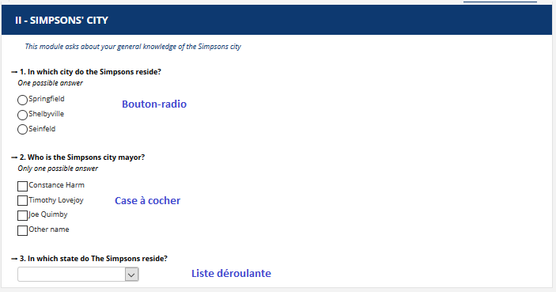

---

Si la question est de type Réponse à choix unique, renseigner :
- le caractère Obligatoire  de la réponse : cochable, décochable. Non fonctionnel à ce jour.
- le type de saisie :
	- Case à cocher (chaque modalité sera cochable ou décochable, mais une seule réponse possible)
	- Bouton-radio (ergonomie web standard pour ce type de réponse, on ne peut pas décocher la réponse à la question (on peut changer la réponse, mais on ne peut pas supprimer une réponse))
	- Liste déroulante (quand la liste des modalités est connue des enquêtés et particulièrement longue (exemple : Département, Pays,NAF2)), ce type de réponse se traduit par un champ libre texte sur le questionnaire papier
		
---

Si la question est de type Réponse à choix unique, renseigner (suite) :
-   Spécifier la liste de codes soit via :
    -   Créer une liste. Dans ce cas :
    	-   Donner un nom signifiant à la Nouvelle liste de codes et entrer pour chaque modalité de réponse, le code de la modalité et son libellé au fur et à mesure via le bouton "Ajouter un Code".
    -   Retrouver dans le référentiel (non fontionnel à ce jour)  : proposera les listes de codes précédemment créées pour l'ensemble des questionnaires publiés dans RMéS depuis Pogues. Sera particulièrement utile pour les listes connues et longues (départements, nomenclatures, etc.).
    -   Retrouver dans le questionnaire : propose les listes de codes précédemment créées pour le questionnaire    
- Valider
  		
---

# Création d'une question de type Réponse à choix multiples

Exemples :

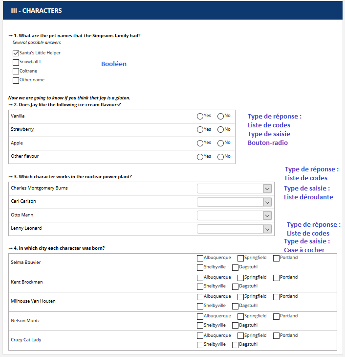

---

Si j'ai créé une question de type Réponse à choix multiples, renseigner :
- Spécifier la liste de codes soit via :
   - Créer une liste. Dans ce cas :
    	- Donner un nom signifiant à la Nouvelle liste de codes et entrer pour chaque modalité de réponse, le code de la modalité et son libellé au fur et à mesure via le bouton "Ajouter un Code".
   - Retrouver dans le référentiel (non fontionnel à ce jour)  : proposera les listes de codes précédemment créées pour l'ensemble des questionnaires publiés dans RMéS depuis Pogues
   - Retrouver dans le questionnaire : propose les listes de codes précédemment créées pour le questionnaire
    
  		
---

Si j'ai créé une question de type Réponse à choix multiples (suite), renseigner :

- Représentation des réponses :
	- Liste de codes ou Booléen
		- si Liste de Codes, spécifier la liste de codes soit via :
    			- Créer une liste
    			- Retrouver dans le référentiel (non fonctionnel à ce jour) 
    			- Retrouver dans le questionnaire 
    	- si Liste de codes, préciser le type de saisie :
            	- Case à cocher
    			- Bouton radio
    			- Liste déroulante			

- Valider
      
---        
  
# Création d'une question de type Tableau (Axe d'information principal : Liste de codes)

Exemple 1 :

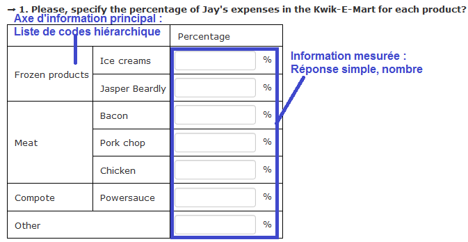

---

Exemple 2 :

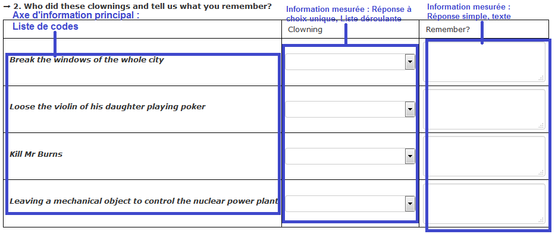

---

Exemple 3 :

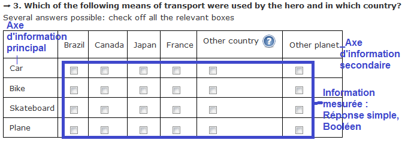

---
Si je veux créer une question de type Tableau (avec en-tête de lignes en première colonne), renseigner :
- Axe d'information principal
	- choisir Liste de codes :
		- Spécifier la liste de codes via les fonctionnalités habituelles
- Axe d'information secondaire :
    - si case cochée :
    	- Spécifier la liste de codes via les fonctionnalités habituelles
- Information mesurée (une seule si Axe d'information secondaire, une ou plusieurs possibles via le bouton + sinon)
    - renseigner une information de type Réponse simple ou Réponse à choix unique     	
- Valider
  		
  		
---

# Création d'une question de type Tableau (Axe d'information principal : Liste)

Si je veux créer une question de type Tableau (sans en-tête de lignes en première colonne), renseigner :
- Axe d'information principal
	- choisir Liste :
		- Nombre de lignes min.
		- Nombre de lignes max.
- Information mesurée (une ou plusieurs possibles via le bouton +)
	- renseigner une information de type Réponse simple ou Réponse à choix unique
- Valider

---

# Pour toute question créée, il faut générer les variables collectées

aller dans l'onglet "Variables collectées" pour les générer

 		
---

- cliquer sur le bouton "Générer les variables collectées" et modifier les libellés et identifiants proposés par défaut par l'application par un libellé signifiant (penser à vos successeurs) et l'identifiant métier de la ou des variables collectées. 

- au fur et à mesure de vos modifications, cliquer sur le bouton "Valider" affiché le plus haut et le plus à droite de votre écran (en bas à droite de l'écran grisé) 

- A la fin de vos modifications, cliquer sur le bouton "Valider" au milieu un peu plus bas dans la partie blanche de l'écran pour valider l'ensemble de vos modification

---

# Gestion d'une liste de codes
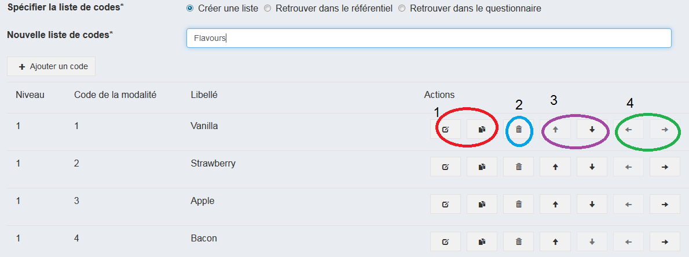

---
# Gestion d'une liste de codes (suite)
Il est actuellement possible via les boutons à droite des modalités de :
1. modifier un élément de la liste : deux premiers boutons, seul l'affichage diffère (le deuxième affichant le libellé avant modif et l'écran de modif)
2. supprimer un élément de la liste
3. déplacer la position d'un élément de la liste : monter ou descendre
4. gérer une hiérarchie entre les éléments de la liste : monter ou descendre dans la hiérachie
---

# Création d'une déclaration

Dans l'onglet "Déclarations", renseigner : 
- le libellé de la déclaration
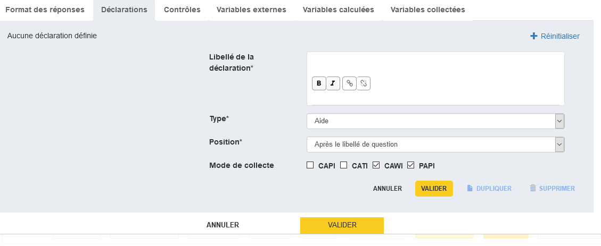

---
# Création d'une déclaration (suite)

- le type de la déclaration, parmi:
	- Consigne
    - Commentaire
    - Aide
    - Avertissement
NB : il n'existe pas de différence de comportement ou d'affichage sur le questionnaire selon le type de déclaration, donc pas de différence pour l'enquêté et pas vraiment pour le concepteur d'enquête. Cependant, puisque l'information est stockée précisément dans le DDI, l'affichage pourrait différer un jour (ce n'est pas prévu pour l'instant). Nous conseillons donc de renseigner ce qui paraît le plus proche du type de la déclaration, sans trop raffiner cependant.

---

# Création d'une déclaration (fin)

- Position : avant ou après le libellé de question
- Valider
        
NB : il est également possible de supprimer ou dupliquer une déclaration

---

# Création d'une info-bulle
Au sein d'un libellé, sélectionner le texte sur lequel doit porter l'info-bulle et cliquer sur le bouton  entouré en rouge sur la copie d'écran jointe

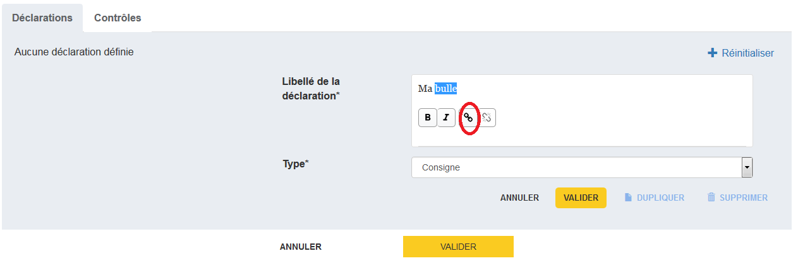

---

# Création d'une info-bulle (suite)
Saisir le texte à afficher en info-bulle et valider en cliquant sur le bouton en rouge sur la copie d'écran jointe ou cliquer sur la croix pour supprimer puis bien valider in fine

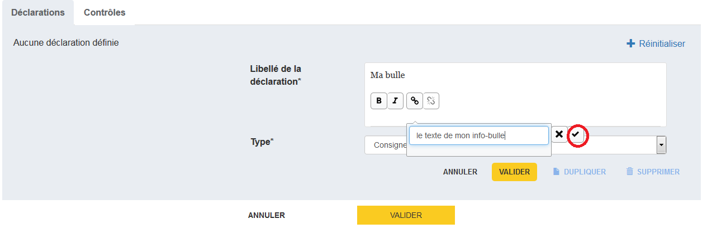

---

# Suppression d'une info-bulle
Sélectionner le texte sur lequel porte l'info-bulle et cliquer sur le bouton en rouge sur la copie d'écran jointe puis bien valider in fine
NB : on ne peut pas modifier une info-bulle mais on peut la supprimer et la récréer en la modifiant.

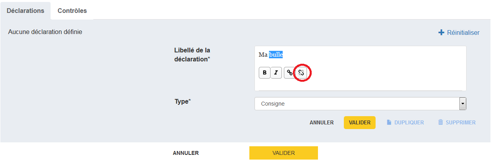

---

# Création d'un contrôle

Un contrôle permet de vérifier la qualité des informations saisies au sein d'un questionnaire. On peut également parler de contrôles de cohérence interne au questionnaire. Cela peut inclure la cohérence avec les données antérieures.

Côté visualisation web du questionnaire (application Eno), un contrôle se déclenche lorsque :
    - la condition est vraie ;
    - ET je suis passé et sorti d'un champ concerné par les conditions (ou je clique sur suivant). 

---

# Création d'un contrôle (suite)

Dans l'onglet "Contrôles" de la séquence, sous-séquence ou question du questionnaire à partir de laquelle on veut appliquer le contrôle

---

# Création d'un contrôle (suite)

Renseigner :
- Description du contrôle : texte libre documentant le contrôle (penser à son successeur ;-)
- Condition (pour laquelle on affiche le message d'erreur) : on appelle les variables du questionnaire en saisissant le caractère dollar \$, au fur et à mesure de la saisie des caractères suivants, l'application propose de l'autocomplétion avec les variables du questionnaire comportant ces caractères et suffixe ensuite automatiquement le nom de la variable saisie avec le caractère \$. exemple : pour la condition l'effectif féminin (on imagine la variable collectée ad hoc EFF_F) est strictement supérieur à l'effectif total de l'entreprise (on imagine la variable collectée ad hoc EFF_TOTAL), on saisira : \$EFF_F$ > \$EFF_TOTAL$. 

---

# Syntaxe pour les conditions des contrôles
Bien séparer les noms de variables (\$VAR\$) des opérateurs ou connecteurs logiques par des espaces.
Exemple : \$EFF_F$ >= \$EFF_TOTAL$

Le séparateur de décimales est le. 
'' : vide qualitatif
99 : vide numérique (repris ensuite manuellement au sein du DDI en attendant mieux)
Pour la valeur 1 : écrire '1' si elle est caractère (liste de codes), 1 si elle est numérique
Exemple : \$SEXE$ = '1' mais \$EFFECTIF$ = 1

---

# Syntaxe pour les conditions des contrôles (dates)

 - comparaison avec le vide : string(\$DATECOL\$) = '' (2 apostrophes)
 - comparaison avec une date : 
 \$DATECOL$ < xs:date(concat(\$ANNEEDAAAA\$,'-06-01')) or \$DATECOL\$ > xs:date(concat(\$ANNEESUIV\$,'-05-31')) 

---
# Syntaxe pour les conditions des contrôles (suite)

\+ : Addition
\-  : Soustraction
\* : Multiplication
= : égal à
!= : différent de
< :  plus petit que (<= : plus petit ou égal à)
\> : plus grand que (\>= : plus grand ou égal à)
and : et
or : ou
div : division avec virgule flottante 
mod : reste de la division avec virgule flottante
Ecrire and, or, etc. en minuscules.

---

# Création d'un contrôle (fin)
Dans l'onglet "Contrôles", renseigner :
- Message d'erreur : saisir ici le message d'erreur qui s'affichera à l'enquêté sur le questionnaire web si la condition est remplie
- Criticité : (comme pour le type de déclaration, il n'y a actuellement pas de différence pour le questionnaire ou l'enquêté entre les 3 criticités mais renseigner ce qui paraît le plus approprié)
	- Information
	- Avertissement
	- Erreur
- Valider

NB : il est également possible de supprimer ou dupliquer un contrôle

---

# Création d'une redirection (ou renvoi ou filtre)

Dans l'onglet "Redirections" de la question sur laquelle appliquer le filtre, renseigner :
- Description de la redirection : ce texte s'affichera sur le questionnaire pdf papier

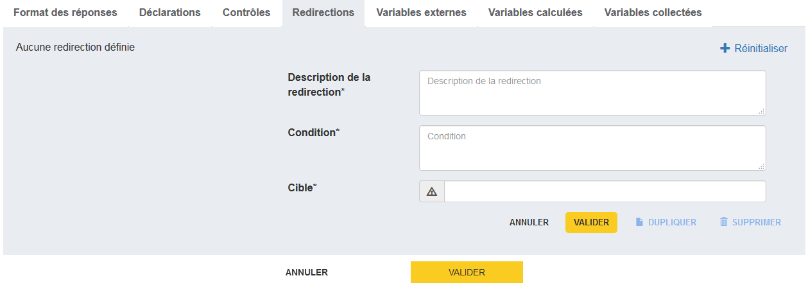

---

# Création d'une redirection (ou renvoi ou filtre) (suite)

Renseigner :
- Condition : (pour laquelle on redirige vers une question cible plus loin dans le questionnaire que la question suivante) : on appelle les variables du questionnaire en saisissant le caractère dollar \$, au fur et à mesure de la saisie des caractères suivants, l'application propose de l'autocomplétion avec les variables du questionnaire comportant ces caractères et suffixe ensuite automatiquement le nom de la variable saisie avec le caractère \$. exemple : si l'on va de la question Q1 (oui '1', non '2') à la question Q10 si Q1='2' on écrira ici \$Q2\$='2' ou bien \$Q2$ != '1' si on veut filtrer aussi en cas de non-réponse. (cf. syntaxe des contrôles pour l'éventail des possibilités de formules de renvois)
- Cible : question cible du filtre. exemple : \$Q10$

---

# Création d'une redirection (ou renvoi ou filtre) (fin)

NB : il est également possible de supprimer ou dupliquer une redirection

---

# Création d'une variable externe

Une variable externe désigne une variable non collectée dans le questionnaire mais utile pour sa personnalisation. Elle peut être une variable collectée antérieurement et rappelée à des fins de contrôle de cohérence avec les réponses passées (dernier CA connu, dernier effectif connu) ou une variable utile pour personnaliser certains éléments du questionnaire (numéro de vague de collecte pour filtrer des questions, une date ou un zonage géographique à afficher dans un libellé de question (année ou régions par exemple) etc.). Elles se définissement via l'onglet "Variables externes" de n'importe quelle question du questionnaire.
- Renseigner :
  - Libellé
  - Identifiant : cf. celui dans le fichier de personnalisation
  - Type de réponse  : parmi Texte, Date, Nombre, Booléen
- Valider

---

# Création d'une variable externe (suite)

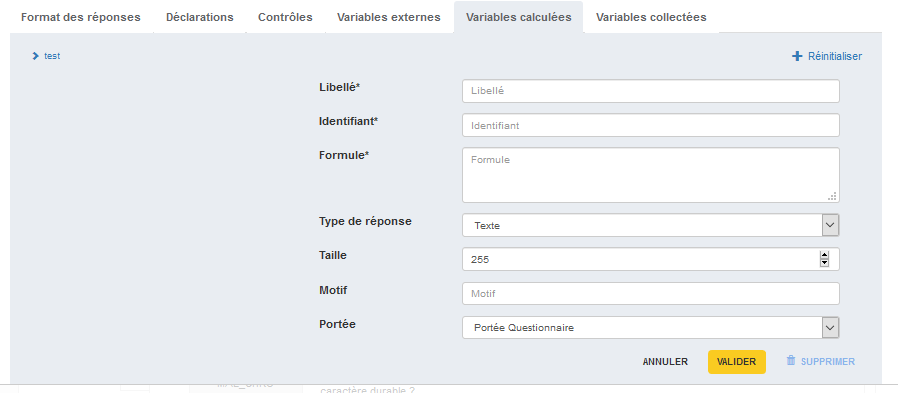

---

# Création d'une variable calculée

Il peut être nécessaire de calculer des variables à partir d'autres variables du questionnaire pour certains contrôles notamment.
Une variable calculée se définit via l'onglet "Variables calculées" de n'importe quelle question du questionnaire.

---

# Création d'une variable calculée (suite)

Renseigner 
- Libellé
- Identifiant
- Formule : possibilité d'utiliser des if, then, else if, else 
	- Exemple : somme des pourcentages du CA dédiés à certaines activités ou somme des dépenses de 			l'entreprise liées à différentes postes budgétaires
- Type de réponse : parmi Texte, Date, Nombre, Booléen (cf. Création d'une question de type réponse simple)

Valider

---
# Exemple : 
Compter le nombre de modalités cochées pour la variable REN
(les modalités étant 7 booléens d'identifiant REN1 à REN7)

number(if (\$REN1\$='') then '0' else \$REN1\$) + 
number(if (\$REN2\$='') then '0' else \$REN2\$) +
number(if (\$REN3\$='') then '0' else \$REN3\$) +
number(if (\$REN4\$='') then '0' else \$REN4\$) +
number(if (\$REN5\$='') then '0' else \$REN5\$) +
number(if (\$REN6\$='') then '0' else \$REN6\$) +
number(if (\$REN7\$='') then '0' else \$REN7\$)

---
# Style gras/italique

Il est actuellement possible de mettre du gras et/ou de l'italique sur des éléments textuels via les boutons dédiés (cf. copie d'écran en page suivante) au sein des libellés de déclaration ou de liste de codes.
NB : les boutons gras et italique sont également disponibles pour les libellés de question mais le générateur de questionnaire Eno ne prend pas en compte la mise en forme spécifiée. En effet, conformément aux bonnes pratiques d'ergonomie d'un questionnaire, tous les libellés de questions s'affichent en gras sur le web. Les boutons gras et italique ne sont pas disponibles pour les libellés de séquence ou de sous-séquence.
NB2 : le gras est visible aussi côté pdf, mais pas l'italique (normal ou bug ?)

---

# Style gras/italique (suite)

---

# Fonctionnalités liés à un élément du questionnaire
Sur chaque élément créé du questionnaire de type séquence/sous-séquence ou question, on trouve les boutons "Voir le détail", "Visualiser" (Web,PDF,Spécification ou DDI) et "Supprimer".
Sur un élément question, on trouve également le bouton "Dupliquer".

---

"Voir le détail" permet de consulter l'élément et de le modifier éventuellement.
"Visualiser" permet de visualiser uniquement l'élément sur lequel on se trouve.
"Supprimer" permet de supprimer un élément.
"Dupliquer" permet de recopier une question. Il faudra bien penser à modifier l'identifiant de la question et celui ou ceux de la ou des variables collectées associées au duplicata. Il n'est actuellement pas possible de dupliquer une liste de codes et de conserver la liste de codes initiale et une liste de codes duplicata modifiée. Tout changement sur la liste de codes duplicata est actuellement répercutée sur la liste de codes initiale dupliquée.

---

# Déplacer des éléments par glisser/déposer

Il est actuellement possible de déplacer un élément de type séquence, sous-séquence, question par glisser-déposer. Pour ce faire, sélectionner l'élément et le glisser/déposer à l'endroit souhaité (quitte à dézoomer suffisamment pour bien avoir sur le même écran la question à déplacer et le morceau d'arborescence du questionnaire où on souhaite la déplacer).
Attention, le déplacement d'une séquence ou sous-séquence déplacent aussi ses enfants (sous-séquences ou questions qui lui sont reliées). 
Attention aux éléments déplacés en cas de redirection, la cible d'une question ne doit pas se retrouver avant cette question.

---

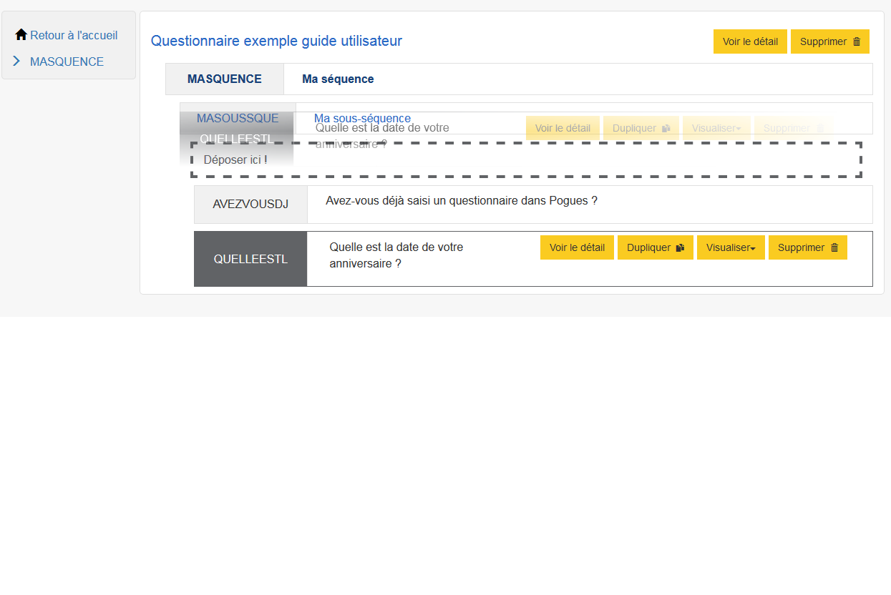

---

# Sauvegarder ou Visualiser le questionnaire

Il est possible de sauvegarder ou de visualiser (Web,PDF,Spécification ou DDI) le questionnaire à tout moment (ou presque) via les boutons dédiés en bas de page de l'IHM Pogues. Le bouton "Publier" sera prochainement accessible, il signifie publier/enregistrer le questionnaire au sein du référentiel RMéS. Le bouton "Saut de page" n'est actuellement pas fonctionnel.

---

# Voir le détail ou Supprimer le questionnaire

Il est aussi possible de "voir le détail" d'un questionnaire (cf. informations saisies à la création du questionnaire) ou de le "supprimer" via les boutons dédiés en haut de page.

---

# Contrôle d'intégrité du questionnaire
Les contrôles d'intégrité du questionnaire suivants sont actuellement implémentés :
- le questionnaire doit comporter au moins une séquence et une question
- unicité des identifiants de question, séquence ou sous-séquence
- unicité des identifiants de variables collectées, externes ou calculées

---

# Ce qui ne fonctionne pas encore dans Pogues 
*complément DDI manuel* 
- L'ajout d'un champ "Précisez" si une modalité de type "Autre" a été cochée
- Renseigner un motif (spécifier une expression régulière) pour une réponse de type texte
- Redirection vers la fin du questionnaire
- Gérer les formats de date
- Gérer des unités autres que €, k€ et %
- Boucler sur les éléments d'un tableau (exemple : individus de plus de 15 ans d'un ménage)
---

# Ce qui ne fonctionne pas encore dans Pogues (suite)

- La prise en compte du multimode (CAWI, CAPI, PAPI, CATI)
*Possible de le renseigner mais n'est pas pris en compte dans l'affichage du questionnaire*
- Le lien entre Pogues et RMéS et notamment publier le questionnaire ou réutiliser une question ou une liste de codes (exemple départements, pays, nomenclature) du référentiel 
- Conditionner le libellé d'une question selon les réponses précédemment obtenues 
- Dupliquer une liste de codes pour en créer une variante
- Le caractère obligatoire de la réponse
*Ne pas le renseigner car cela bloque la visualisation du questionnaire web*
- Le bouton "Saut de page" en bas au centre de l'IHM Pogues
- paramétrages du pdf (nombre de colonnes, mise en page portrait ou paysage, type de saisie)
---

# Ce qui ne fonctionne pas encore dans Pogues (suite)
choix du type de numérotation parmi :
- 1 numérotation de 1 à n pour l'ensemble des questions du questionnaire : c'est la numérotation la plus courante dans la littérature, celle que l'on retrouve dans les questionnaires ménages de l'insee en général. C'est aussi la plus simple à utiliser lorsqu'il y a des filtres à décrire dans un questionnaire papier.
- 1 numérotation de 1 à n pour chacun des modules du questionnaire (on recommence à 1 à chaque nouveau module) : c'est la numérotation la plus courante dans les enquêtes entreprises de l'Insee.
- pas de numérotation : c'est un choix qui peut-être fait lorsque les filtres sont très nombreux, et conduisent à une numérotation apparente qui peut être un peu bizarre. C'est le choix notamment de l'enquête emploi.

---

# Ce que l'on ne sait pas encore faire dans Pogues
- Comparer un champ numérique vide 
*complément DDI manuel*
- Ajouter des totaux (fixe à 100% ou calculer comme la somme des éléments de la colonne) à un tableau de variables collectées
*complément DDI manuel*
-... 
 
 ---
 # Ce que l'on ne fera pas dans Pogues
 - Spécifier si la redirection est de type filtre masqué (elle l'est par défaut) ou filtre grisé
*complément DDI manuel* 

